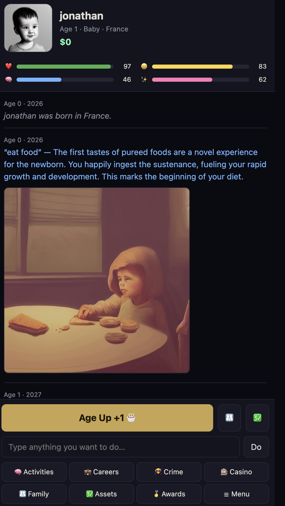

<p align="center">
  <a href="https://jmrothberg.github.io/BitLife/">
    
  </a>
</p>

<h1 align="center">▶ <a href="https://jmrothberg.github.io/BitLife/">Play JMR's BitLife in your browser</a></h1>

<p align="center">
  <b>https://jmrothberg.github.io/BitLife/</b><br/>
  No install. No login. Click the link, the game loads, everything runs locally in your browser.
</p>

---

# BitLife — local-LLM life simulator

A **BitLife-style life simulator** that runs entirely in your browser. The game engine is
**premade and deterministic** — you live a life by clicking **Age Up** and menu buttons, and it
works **instantly with no AI models loaded at all**. The AI is **optional and off by default**
(enable it under **AI Features** on the start screen — it's heavy on phones): type any free-form
action and a small **local LLM** (Gemma 4 E4B via Transformers.js / WebGPU) interprets it into
bounded, sanitized game effects, and a **local diffuser** (Stable Diffusion 1.5, bundled in
`vendor/web-txt2img/`) paints your character avatar and life-event scenes.

Includes a stock market with stocks, crypto and bonds that move every year, plus **insider trading**
— act on a tip for a big gain, but the SEC may investigate and send you to prison (the "Martha"
achievement). Plus real estate, pets, fame, achievements/ribbons, multiple save slots, and seeded
reproducible lives.

## An homage to the original — with two new things

JMR's BitLife is built in **homage to BitLife by Candywriter, LLC** — it recreates the original's
turn-based life simulation (be born, **Age Up**, random life events with choices, careers, school,
crime → prison, casino, relationships, investing, achievements/ribbons) as faithfully as practical.
It adds **two things the original doesn't have**, both running **locally in your browser**:

1. **Talk to your life — interact with and get more information from a local LLM.** Type any
   free-form action ("start a food truck", "run for office") and a small in-browser model (Gemma)
   interprets it into bounded, safe game effects. An optional **AI narrator** also comments on your
   life as you age, and a built-in **Hint/Help** lets you ask the game how anything works.
2. **Art that's both pre-made and freshly generated.** A local Stable Diffusion model paints your
   character avatar and life-event scenes. Common scenes ship **pre-baked for instant display**, and
   anything new is **generated on the fly** and cached — so art is always either instant or arriving.

## How it compares to the original

A living scorecard of how close this build is to the real game. ✅ solid · 🟡 partial/shallow ·
❌ missing · ➕ beyond the original. Full detail in **[AGENTS.md](./AGENTS.md)**.

Full system-by-system table (v0.9.7). Counts + the gap-closure roadmap live in **[AGENTS.md](./AGENTS.md)** (the contributor/LLM guide).

| System | Real BitLife | This game | Status |
|---|---|---|---|
| Core stats | Happiness / Health / Smarts / Looks (+ Fame, hidden Karma) | All four + Fame; no Karma | 🟡 |
| Character creation | Name, gender, country/city; Bitizen custom looks | Name, gender, country, **talent**, **zodiac**, **seed** | ✅ |
| Age-up + random events | Hundreds per stage, multi-choice + outcomes | 82 events across 7 life stages | 🟡 |
| School & education | Daycare → uni / grad / med / law; majors, GPA, clubs, sports, class president, loans, scholarships, dropout | Auto K-12 + college, 12 degrees, study/tutor | 🟡 |
| Careers (regular) | 100+ jobs; ladders, performance, fired, retire, unions, lawsuits | 43 jobs; apply / work / promote / quit | 🟡 |
| Special / fame careers | Actor, musician, writer, model, influencer, athlete (leagues), director | Fame-path jobs (actor/musician/athlete/model/influencer); no fame activities | 🟡 |
| Military | Branches, ranks, deployment, court martial, medals | **Army/Navy/Air Force career tracks** (ranks); no deployments yet | 🟡 |
| Royalty | Born/marry in, rule, throne, scandals, exile | **Born royal** (rare) + royal duties (stipend/fame); no throne politics yet | 🟡 |
| Politics | Run mayor → president, campaigns, elections | Run for office (campaign → election) | 🟡 |
| Business ownership | Start/own businesses, employees | **Start a business** (4 types) with yearly revenue; no employees yet | 🟡 |
| Crime | ~15 crimes; interactive burglary/heists; gangs/mafia; serial killer | 11 crimes + **live burglary & bank/jewelry heists**, **gangs** (→ boss), lawyers | 🟡 |
| Prison | Escape (interactive), riots, gangs, parole, contraband, death row | Live escape mini-game + **parole, appeal, prison jobs**; no riots/contraband | 🟡 |
| Justice / lawsuits | Lawyers, trials, plea deals, sue / get sued | Lawyer, parole, appeal, prison jobs, **file a lawsuit**; no get-sued yet | 🟡 |
| Casino & mini-games | Blackjack/slots/roulette/video poker…; escape & heist mini-games | 7 casino games (slots/blackjack/roulette/horses **live**) + prison/fight/burglary mini-games | ✅ ➕ |
| Fights | Event stat-roll | A live **Street Fighter-style brawler** (punch/kick/jump/duck) | ➕ |
| Relationships | Full family tree; friends/enemies/coworkers; dating app; marriage/prenup/divorce/custody/alimony; affairs | Family + **Find Love** dating, move-in, vacation, cheat, marry, kids, **divorce + prenup + asset split**; aging & death | 🟡 |
| Reproduction | Pregnancy, adoption, IVF, surrogacy, donors, complications | Have-a-baby via partner | 🟡 |
| Health & medical | 100s of diseases, specialists, surgeries, mental health, addictions/rehab, STDs, disabilities | Disease system + **addictions & STDs** (from bars/casino/cheating) treated at the clinic | 🟡 |
| Activities / lifestyle | Gym/library/spa/movies/club/museum/concert; tattoos, religion, astrology | Mind & Body / Doctor / Education **+ nightlife, museum, concert, shopping, tattoo, religion** | 🟡 |
| Travel / vacation | Countries, cruises, hotels; emigrate | **5 destinations** + **emigrate to any of 30 countries** | 🟡 |
| Assets | Real estate (+ mortgage/rent/flip), vehicles (+ insurance/upkeep), jewelry/art; haggle/appraise/pawn | Real estate, **vehicle dealership**, **valuables** (jewelry/art, appreciate); no haggle/pawn yet | 🟡 |
| Money / finance | Bank, interest, loans, mortgages, cards, debt, bankruptcy, taxes, lottery, charity, will/inheritance | Loans, **mortgages**, bankruptcy, lottery, net worth, inheritance, income/crypto tax | 🟡 |
| **Investing + insider trading** | Stocks/crypto/bonds/real estate; SEC "Martha" | Same, incl. insider trading + the Martha ribbon | ✅ |
| Fame | Fame bar, social media/go-viral, books/albums/films, endorsements, scandals, paparazzi | Fame stat + Famous ribbon; no fame activities | 🟡 |
| Pets | Pet store (many species), train/walk/vet/breed/shows | **Pet store (7 species)** + childhood adopt + interactions; pets age & die; no breed/shows | 🟡 |
| Achievements / ribbons | Large set + end-of-life summary | 29 ribbons + death summary | 🟡 |
| Countries / nationality | 150+ nations, languages, citizenship | 30 (cosmetic) | 🟡 |
| Generations / dynasties | Continue as your heir; inheritance | **Continue as your heir** + inheritance (estate tax) | 🟡 |
| God Mode / Time Machine / Surrender | Edit stats, rewind a year, restart | **God Mode** + **Time Machine** (rewind one year) + New Life | ✅ |
| Save / multiple lives | Yes | localStorage, multiple slots, autosave | ✅ |
| Reproducible (seeded) lives | — | Seed reproduces an entire life | ➕ |
| **Type free-form actions (local LLM)** | — (buttons only) | Gemma interprets typed actions → safe effects | ➕ |
| **AI narrator + Hint/Help** | — | LLM comments on your life; ask how anything works | ➕ |
| **Generated art (local diffuser)** | — (emoji/clip-art) | SD 1.5 avatar + scenes, pre-baked **and** live | ➕ |

> **Where it stands:** the core loop is ~70–80% of the original; total feature surface ~40%; content
> volume ~20% (and growing). Biggest gaps: a real **health/disease** system, **finance** (loans/
> mortgages/taxes/inheritance), **relationship depth** (dating/divorce/custody), **travel & vehicles**,
> and the structural systems (**generations, royalty, politics, military**). A full phased roadmap to
> close every gap is in **[AGENTS.md](./AGENTS.md)**.

## Play it from GitHub

The repo is set up to be served as a static site straight from GitHub Pages — no install, no
server. Anyone with the link opens it, the page loads, and from then on everything runs in their
browser (models stream from the Hugging Face CDN on first load, then live in browser storage).

**Live URL (after enabling Pages):** `https://jmrothberg.github.io/BitLife/`

**Download once, then play offline.** The deterministic game starts instantly while the local LLM
(~3 GB) and diffuser (~2 GB) download in the background — a progress bar at the top of the screen
shows how far along they are. Once the **"Offline-ready ✓"** pill (and toast) appear, the one-time
download is complete and **you can disconnect from the internet entirely** — the game, the
typed-AI interpreter, and live image generation all keep working with no connection. The service
worker (`coi-serviceworker.js`) caches the app shell + CDN runtime, while Transformers.js and the
image worker cache the model weights in the browser's Cache Storage; clearing site data is the only
thing that forces a re-download.

**One-time setup on GitHub:**

1. Push this repo to GitHub.
2. Repo → **Settings → Pages**.
3. *Source:* **Deploy from a branch**, branch `main`, folder `/ (root)`. Save.
4. Wait ~1 min for the first deploy. Drop a 1200×630 PNG at `assets/og.png` for the link-preview
   card when the URL is pasted into Slack / iMessage / Twitter etc.

**How cross-origin isolation + offline caching work on Pages.** The in-browser image worker (Stable
Diffusion 1.5 via `onnxruntime-web`) needs `crossOriginIsolated` for SharedArrayBuffer / WASM
threads. GitHub Pages can't set COOP/COEP headers, so the page registers `coi-serviceworker.js` on
first visit — it installs a service worker that re-injects those headers, then auto-reloads once.
That same service worker doubles as an **offline app-shell cache**: it precaches the page, content
data and pre-baked art, and runtime-caches the CDN modules + WASM, falling back to cache when
there's no network. It deliberately skips the multi-GB model weights (`.onnx`/`.bin`/etc.) because
Transformers.js and the image worker already persist those in their own caches — so nothing is
stored twice. After that, WebGPU + threaded WASM both work as if you were running `serve.py`
locally. (Requires HTTPS, which Pages provides automatically. `.nojekyll` is included so Pages
serves every file as-is.)

## Run it locally

For local development you can also use the included server, which sets the same COOP/COEP
headers directly (no service-worker reload step):

```bash
cd ~/BitLife
python3 serve.py 8080
# then open:
http://localhost:8080/index.html
```

- **Browser:** Chrome/Edge 113+ with **WebGPU** strongly recommended (WASM fallback works, slower).
- **First load:** downloads ~5 GB of models (Gemma + SD 1.5), cached afterward.
- **No-AI mode:** tick *"Skip loading AI models"* on the start screen to play the deterministic game
  only (no typed AI, no images) — instant.
- **Ollama option:** tick *"Use local Ollama"* and give a model name to route typed actions through
  a local Ollama server instead of in-browser Gemma (set `OLLAMA_ORIGINS` so the browser can reach it).

## Layout

| Path | What it is |
|------|------------|
| `index.html` | The entire self-contained game (engine + UI + LLM/image integration). |
| `bitlife_data.json` | Premade content tables (events, activities, careers, market, insider tips, achievements). A minimal copy is embedded in `index.html` as `FALLBACK_DATA` so it still runs if this file can't be fetched. |
| `vendor/web-txt2img/` | Bundled in-browser Stable Diffusion 1.5 worker (ONNX Runtime Web / WebGPU). |
| `vendor/three/` | Bundled **Three.js** (vendored locally so the 3D prison-break game runs offline — no CDN at runtime). |
| `minigames/` | Self-contained ES-module mini-games (e.g. `prison_escape.js`), lazy-loaded on launch. Drop-in extension point. |
| `serve.py` | Dev server that sends the COOP/COEP headers the worker needs. |
| `pregen_art.py` | **Optional** GPU batch baker for life-event scene art (writes `assets/` + `manifest.json`). |
| `assets/` | Optional pre-generated PNGs used **instantly** when present. |
| `AGENTS.md` | **How to add content/features fast** — schemas, recipes, and the rules (offline, determinism) for humans and LLMs. |

## Test the mini-games directly

No need to live a whole life to reach the casino or land in prison. These links open the
live game in your browser, spin up a **sandbox life** (age 30, $1,000,000, in prison), and
jump straight to a mini-game — **click any of them:**

| Click to play | Launches |
|------|----------|
| ▶ [**Test menu**](https://jmrothberg.github.io/BitLife/#test) | A menu to launch any mini-game |
| ▶ [**Slots**](https://jmrothberg.github.io/BitLife/#test=slots) | 🎰 Slot machine |
| ▶ [**Blackjack**](https://jmrothberg.github.io/BitLife/#test=blackjack) | 🃏 Blackjack |
| ▶ [**Roulette**](https://jmrothberg.github.io/BitLife/#test=roulette) | 🎡 Roulette (spinning wheel) |
| ▶ [**Horse racing**](https://jmrothberg.github.io/BitLife/#test=horses) | 🏇 Horse racing |
| ▶ [**Prison Break**](https://jmrothberg.github.io/BitLife/#test=prison) | 🪜 Prison Break (Three.js) |
| ▶ [**Street Fight**](https://jmrothberg.github.io/BitLife/#test=fight) | 🥊 Street Fight (punch / kick / jump / duck) |
| ▶ [**Burglary**](https://jmrothberg.github.io/BitLife/#test=burglary) | 🏠 Burglary (sneak through a house for loot) |

You can also just edit the `#test=…` hash after the page has loaded to switch games. (Running
locally? The same hashes work on `http://localhost:8080/index.html#test` via `serve.py`.)

## Extending the game

Want to add an event, a career, or a new casino mini-game? The game is **data-driven** —
most content is a JSON object in `bitlife_data.json`, and the engine, menus, saves, and art
baker pick it up automatically. See **[AGENTS.md](./AGENTS.md)** for copy-paste recipes,
the full data schema, and the two non-negotiable rules:

- **It plays offline after first load** — never add a runtime network call to the core game.
- **It stays deterministic** — all gameplay randomness goes through the seeded RNG, so the
  same seed always replays the same life.

## Art is "made in advance" where practical

Every image resolves **static asset → IndexedDB cache → live generate**:

1. **Static assets (instant):** if `assets/manifest.json` exists, matching scenes load with no
   generation. Bake them with `python3 pregen_art.py` on a machine with a GPU.
2. **Persistent cache:** everything generated in-browser is stored in **IndexedDB**, so replays and
   later sessions are instant.
3. **Idle background pre-render:** once SD 1.5 loads, the game pre-renders the current + next
   life-stage avatar and common event scenes during idle time — without blocking play.

## Safety of typed actions

Typed actions go to the LLM, which must return a small JSON directive. All proposed effects are
clamped (`sanitizeLlmEffects` → `applyEffects` → 0–100), so the AI flavors the story but can't break
the game. A parse failure just shows narration; gameplay never blocks on the model.

---
*v0.9.7 — Jonathan Rothberg, 2026. An homage to BitLife by Candywriter, LLC; not affiliated with or
endorsed by Candywriter. All AI (LLM + image) runs locally in your browser.*
